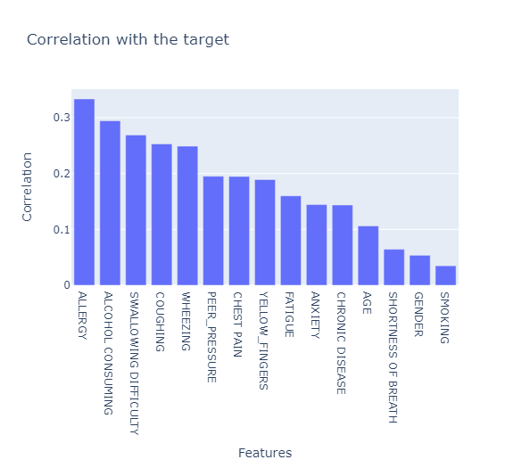
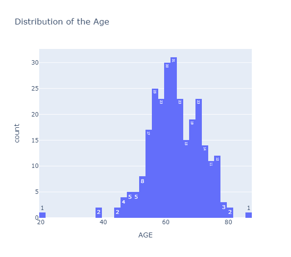
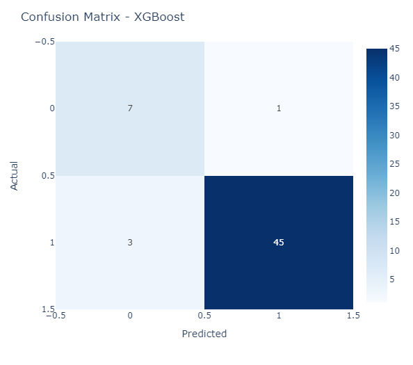
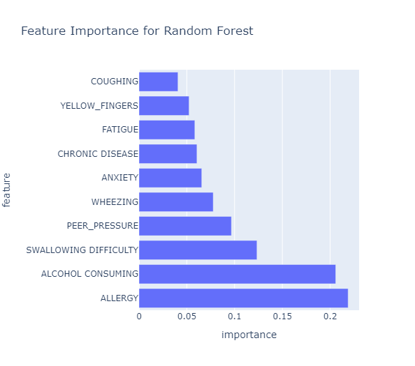
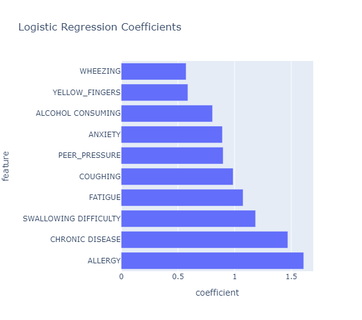

# Lung Cancer Prediction: Analyzing and Classifying Survey Data

## Introduction

This project analyzes a lung cancer survey dataset to predict the likelihood of lung cancer based on various features. We applied multiple classification models, including Logistic Regression, Random Forest, SVM, and XGBoost, to assess their performance in predicting lung cancer risk.

## Project Structure

- **Data Loading and Exploration**: Initial inspection and cleaning of the dataset.
- **Data Preprocessing**: Handling missing values, duplicates, and class imbalance.
- **Feature Selection**: Using Recursive Feature Elimination (RFE) to select the most relevant features.
- **Modeling**: Training and evaluating Logistic Regression, Random Forest, SVM, and XGBoost models.
- **Visualization**: Visualizing correlation, feature importance, and model performance.

## Visualizations

### 1. Correlation with Target Variable

### 2. Age Distribution

### 3. Confusion Matrix - Random Forest

### 4. Feature Importance (Random Forest)

### 5. Logistic Regression Coefficients

## Models Used

- **Logistic Regression**
- **Random Forest**
- **Support Vector Machine (SVM)**
- **XGBoost**

## Conclusion

The project successfully identified key features influencing lung cancer prediction. Random Forest and Logistic Regression models were particularly effective in providing insights through feature importance and coefficients. Future enhancements could include hyperparameter tuning and cross-validation to improve model accuracy further.
